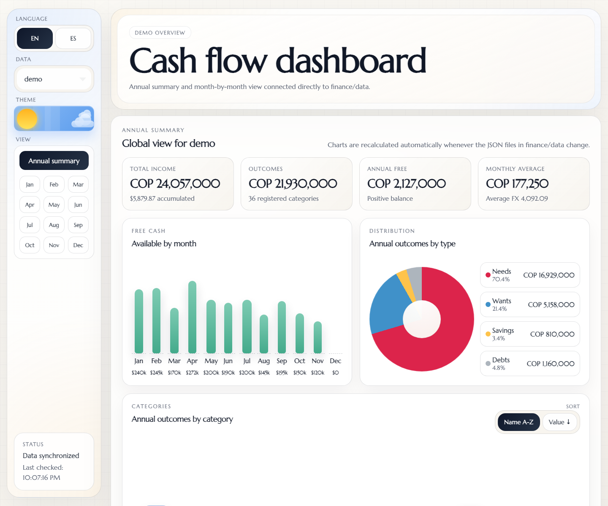
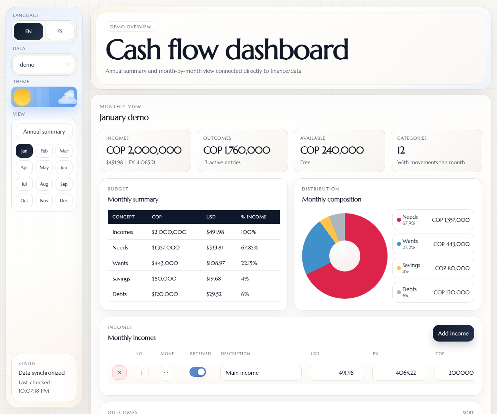
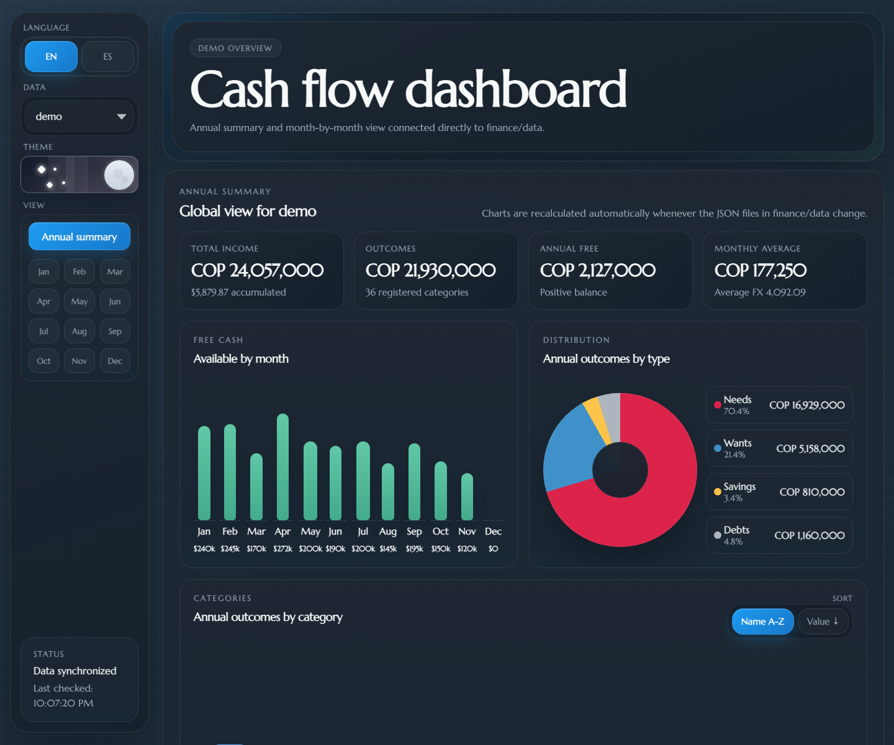

# Minerva

Minerva is a local personal finance cash flow dashboard. It reads JSON data from `finance/data`, calculates annual and monthly summaries, and lets you edit incomes and expenses from a web interface without a database or required external services.

The app is designed for budgeting in COP and USD, reviewing expense distribution, switching between annual and monthly views, and keeping a simple change history for each movement.

## Features

- Annual dashboard with KPIs, monthly free cash flow, expense distribution by type, and comparison table.
- Monthly view with incomes, expenses, categories, budget summary, and detailed movements.
- Local data editing: create, update, mark as paid/received, delete, and reorder incomes or expenses.
- Change history per movement through `created_at`, `updated_at`, and `history`.
- English and Spanish UI support.
- Light/dark theme with preferences saved in `localStorage`.
- Data refresh after edits and when returning to the browser tab.
- Optional USD/COP rate lookup through Coinbase from `/api/fx/usd-cop`.

## Screenshots

Annual dashboard with demo data:



Monthly dashboard with demo data:



Dark mode with demo data:



## Stack

- Frontend: HTML, CSS, and JavaScript without a framework.
- Local backend: Python `http.server` with custom JSON endpoints.
- Persistence: JSON files inside `finance/data`.
- Build: no build step and no npm dependencies.

## Structure

```text
.
+-- index.html
+-- styles.css
+-- app.js
+-- server.py
`-- finance
    +-- shared
    |   +-- categories.json
    |   +-- currencies.json
    |   `-- types.json
    `-- data
        +-- demo
        +-- 2026
        `-- 2027
```

Main files:

- `index.html`: interface markup.
- `styles.css`: styling, responsive layout, and themes.
- `app.js`: data loading, calculations, rendering, interactions, and backend calls.
- `server.py`: local server, write endpoints, and USD/COP rate proxy.
- `finance/shared`: shared category, type, and currency catalogs.
- `finance/data`: financial data by year or dataset.

## Requirements

- Python 3.10 or newer.
- A modern browser.
- Internet access only if you want to use the live USD/COP rate.

## Run Locally

From the project root:

```bash
python3 server.py
```

The server will be available at:

```text
http://localhost:8123
```

`server.py` attempts to open the browser automatically. To stop it, press `Ctrl+C` in the terminal.

You can also open `index.html` directly, but the app needs to be served over HTTP to load JSON with `fetch` and to save changes through the local endpoints.

## Data

The app automatically discovers folders inside `finance/data`. Each folder can represent a year, such as `2026`, `2027`, or a dataset such as `demo`.

### Incomes

Incomes live in:

```text
finance/data/<year>/incomes/incomes.json
```

Expected format:

```json
{
  "months": [
    {
      "name": "January",
      "month_id": "01-january",
      "income_usd": 500,
      "usd_cop": 4000,
      "income_cop": 2000000,
      "entries": [
        {
          "received": true,
          "description": "Main income",
          "amount_usd": 500,
          "usd_cop": 4000,
          "amount_cop": 2000000,
          "created_at": "2026-04-15T15:21:01.000Z",
          "updated_at": "2026-04-15T15:21:01.000Z",
          "history": []
        }
      ]
    }
  ]
}
```

When incomes are edited from the interface, the server recalculates `income_usd`, `income_cop`, and `usd_cop` for the month using entries marked as received.

### Expenses

The recommended format is one unified file per month.

Unified monthly format:

```text
finance/data/<year>/outcomes/01-january.json
```

```json
{
  "entries": [
    {
      "paid": true,
      "description": "Rent",
      "category": "Housing",
      "amount_cop": 680000,
      "type": "needs",
      "created_at": "2026-04-15T15:21:01.000Z",
      "updated_at": "2026-04-15T15:21:01.000Z",
      "history": []
    }
  ]
}
```

The app can still read the legacy format separated by type, but new data should use the unified monthly format:

```text
finance/data/<year>/outcomes/01-january/needs.json
finance/data/<year>/outcomes/01-january/wants.json
finance/data/<year>/outcomes/01-january/savings.json
finance/data/<year>/outcomes/01-january/debts.json
```

```json
{
  "entries": [
    {
      "paid": true,
      "description": "Groceries",
      "category": "Market",
      "amount_cop": 290000,
      "created_at": "2026-04-15T15:21:01.000Z",
      "updated_at": "2026-04-15T15:21:01.000Z",
      "history": []
    }
  ]
}
```

Valid types:

- `needs`
- `wants`
- `savings`
- `debts`

## Create a New Year

1. Create a folder in `finance/data`, for example:

   ```text
   finance/data/2028
   ```

2. Add incomes:

   ```text
   finance/data/2028/incomes/incomes.json
   ```

3. Add expenses using either the unified format or the format separated by type.

4. Restart or refresh the app. The new year will appear in the selector if the folder is available from the local server.

You can use `finance/data/demo` as a reference dataset.

## Local Endpoints

The server exposes endpoints used by `app.js`:

- `GET /api/fx/usd-cop`: gets the USD/COP rate from Coinbase.
- `POST /api/entries/create`: creates an expense.
- `POST /api/entries/update`: updates an expense.
- `POST /api/entries/delete`: deletes an expense.
- `POST /api/entries/reorder`: reorders expenses.
- `POST /api/entries/active`: legacy endpoint that changes the paid flag of an expense.
- `POST /api/incomes/create`: creates an income.
- `POST /api/incomes/update`: updates an income.
- `POST /api/incomes/delete`: deletes an income.
- `POST /api/incomes/reorder`: reorders incomes.

The app still accepts the legacy `active` flag when reading old data or payloads, but current JSON should use `paid` for expenses and `received` for incomes.

For safety, `server.py` only allows writes to `.json` files inside `finance/data`.

## Privacy

Financial data is stored in local files. The current `.gitignore` excludes `finance/data/*` and keeps only the `finance/data/demo` dataset as publishable sample data.

Before sharing the project, verify that you are not including real financial information in the JSON files.

## Development

There are no automated tests or build pipeline configured. For basic validation:

```bash
python3 -m py_compile server.py
python3 server.py
```

Then open `http://localhost:8123` and verify:

- Initial data loading.
- Switching between years or datasets.
- Annual and monthly views.
- Creating, editing, deleting, and reordering movements.
- JSON persistence after changes.
