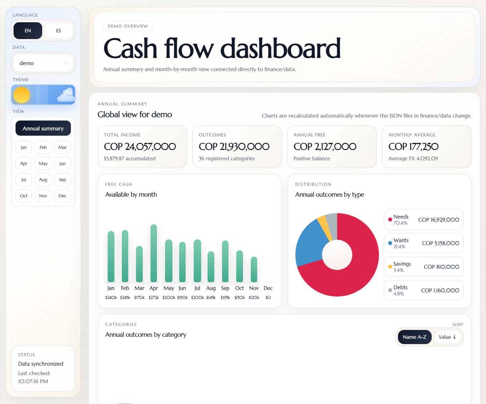
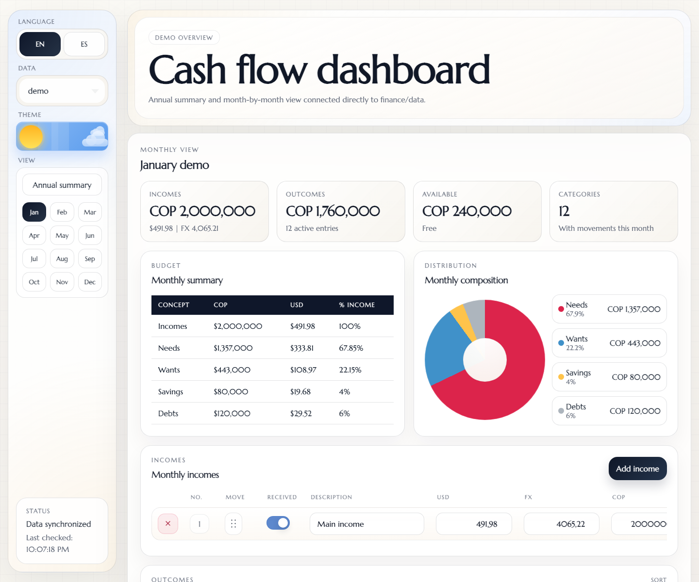
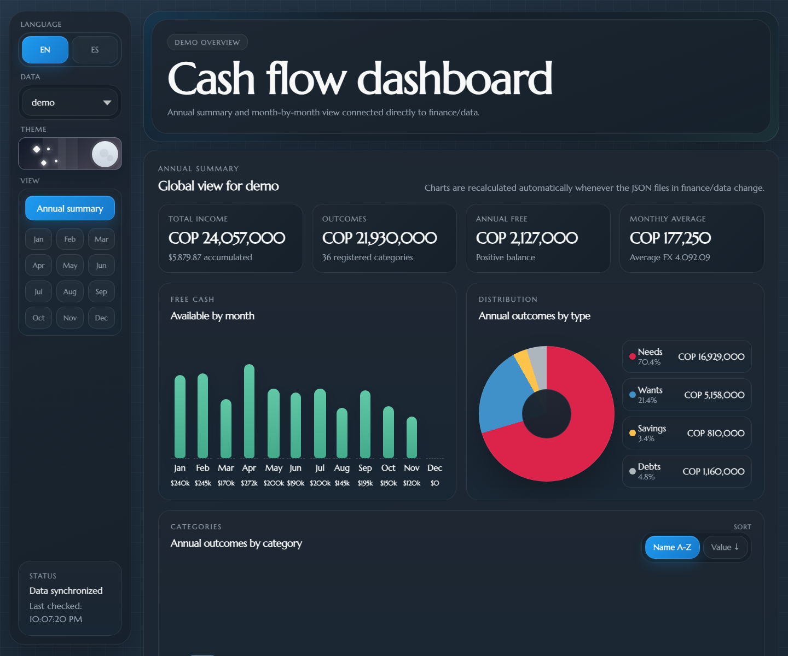

# Minerva

Minerva is a local personal finance dashboard. It reads JSON data from `finance/data/cash_flow` and `finance/data/debts`, calculates annual and monthly summaries, and lets you edit incomes, expenses, and debts from a web interface without a database or required external services.

The app is designed for budgeting in COP and USD, reviewing expense distribution, switching between annual and monthly views, and keeping a simple change history for each movement.

## Features

- Annual dashboard with KPIs, monthly free cash flow, expense distribution by type, and comparison table.
- Monthly view with incomes, expenses, categories, budget summary, and detailed movements.
- Local data editing: create, update, mark as paid/received, delete, and reorder incomes or expenses.
- Change history per movement through `created_at`, `updated_at`, and `history`.
- English and Spanish UI support.
- Light/dark theme with preferences saved in `localStorage`.
- Data refresh after edits and when returning to the browser tab.
- Optional USD/COP rate lookup through Coinbase from `/api/fx/usd-cop`.

## Screenshots

Annual dashboard with demo data:



Monthly dashboard with demo data:



Dark mode with demo data:



## Stack

- Frontend: HTML, CSS, and JavaScript without a framework.
- Local backend: Python `http.server` with custom JSON endpoints.
- Persistence: JSON files inside `finance/data/cash_flow` and `finance/data/debts`.
- Build: no build step and no npm dependencies.

## Structure

```text
.
+-- legacy
|   +-- index.html
|   +-- styles.css
|   `-- app.js
+-- web
+-- server.py
+-- desktop
`-- finance
    +-- app                  <- ships with the repo
    |   +-- shared
    |   |   +-- categories.json
    |   |   +-- currencies.json
    |   |   `-- types.json
    |   +-- images
    |   `-- demo             <- the Demo dataset
    |       +-- cash_flow
    |       +-- debts
    |       `-- nutrition
    `-- data                 <- your own data, ignored by git
        +-- cash_flow
        |   +-- 2026
        |   `-- 2027
        +-- debts
        `-- nutrition
```

Main files:

- `legacy/index.html`: interface markup.
- `legacy/styles.css`: styling, responsive layout, and themes.
- `legacy/app.js`: data loading, rendering, interactions, and backend calls.
- `web`: the React rewrite, served on the same port when built.
- `server.py`: local server, the money math, write endpoints, and USD/COP rate proxy.
- `desktop`: macOS launcher app to start and stop the server without a terminal.
- `finance/app/shared`: shared category, type, and currency catalogs.
- `finance/app/demo`: the sample dataset behind the Demo switch.
- `finance/data`: your own data — cash flow by year, debts, and the meal plan.
  Since 2026-08 it is a symlink into iCloud Drive (`Minerva/data`), so the
  files are backed up, versioned, and readable by the iOS app anywhere.
  It is ignored by git and can live anywhere (see below).

## Requirements

- Python 3.10 or newer.
- Firefox (preferred) or any modern browser. Make sure hardware acceleration is
  on in the browser settings, otherwise the dashboard scrolls and animates
  sluggishly.
- Internet access only if you want to use the live USD/COP rate.

## Run Locally

From the project root:

```bash
python3 server.py
```

The server will be available at:

```text
http://localhost:8123
```

`server.py` opens Firefox automatically, falling back to Chrome and then to the system default browser. Set `MINERVA_BROWSER=chrome` (or `=default`) to override that for a single run:

```bash
MINERVA_BROWSER=chrome python3 server.py
```

To stop the server, press `Ctrl+C` in the terminal.

## Desktop App (macOS)

If you would rather not use a terminal, build the launcher app once:

```bash
./desktop/build.sh
```

That leaves `Minerva.app` in `~/Applications`, ready for the Dock or Spotlight.
Opening it turns the server on and shows the dashboard in the browser you pick;
it also reloads the server, changes the port, and shows the server log. See
`desktop/README.md`.

The port is `8123` unless `MINERVA_PORT` says otherwise, which is how the app
changes it:

```bash
MINERVA_PORT=8125 python3 server.py
```

The old app answers at `/legacy/`, and `/` redirects there. Opening `legacy/index.html` straight from disk does not work: the app needs to be served over HTTP to load JSON with `fetch` and to save changes through the local endpoints.

## Data

There are two datasets, and the **Live / Demo** switch in the header picks which
one everything reads and writes:

- **Live** is your own data in `finance/data`. It is ignored by git, and
  `MINERVA_DATA_ROOT` moves it anywhere on disk:

  ```bash
  MINERVA_DATA_ROOT=~/Documents/minerva-data python3 server.py
  ```

  The desktop app has a folder picker for the same thing. If you have no data
  yet, start on Demo.

- **Demo** is the sample dataset in `finance/app/demo`, which ships with the
  repo and is safe to publish. It is editable — a sandbox to try things out —
  so remember that changes there do show up in `git status`.

Inside either one, the app discovers the folders in `cash_flow` on its own. Each
folder is a year, such as `2026` or `2027`.

### Incomes

Incomes live in:

```text
finance/data/cash_flow/<year>/incomes/incomes.json
```

Expected format:

```json
{
  "months": [
    {
      "name": "January",
      "month_id": "01-january",
      "income_usd": 500,
      "usd_cop": 4000,
      "income_cop": 2000000,
      "entries": [
        {
          "received": true,
          "description": "Main income",
          "amount_usd": 500,
          "usd_cop": 4000,
          "amount_cop": 2000000,
          "created_at": "2026-04-15T15:21:01.000Z",
          "updated_at": "2026-04-15T15:21:01.000Z",
          "history": []
        }
      ]
    }
  ]
}
```

When incomes are edited from the interface, the server recalculates `income_usd`, `income_cop`, and `usd_cop` for the month using entries marked as received.

### Expenses

The recommended format is one unified file per month.

Unified monthly format:

```text
finance/data/cash_flow/<year>/outcomes/01-january.json
```

```json
{
  "entries": [
    {
      "paid": true,
      "description": "Rent",
      "category": "Housing",
      "amount_cop": 680000,
      "type": "needs",
      "created_at": "2026-04-15T15:21:01.000Z",
      "updated_at": "2026-04-15T15:21:01.000Z",
      "history": []
    }
  ]
}
```

The app can still read the legacy format separated by type, but new data should use the unified monthly format:

```text
finance/data/cash_flow/<year>/outcomes/01-january/needs.json
finance/data/cash_flow/<year>/outcomes/01-january/wants.json
finance/data/cash_flow/<year>/outcomes/01-january/savings.json
finance/data/cash_flow/<year>/outcomes/01-january/debts.json
```

```json
{
  "entries": [
    {
      "paid": true,
      "description": "Groceries",
      "category": "Market",
      "amount_cop": 290000,
      "created_at": "2026-04-15T15:21:01.000Z",
      "updated_at": "2026-04-15T15:21:01.000Z",
      "history": []
    }
  ]
}
```

Valid types:

- `needs`
- `wants`
- `savings`
- `debts`

### Debts

Debts live in:

```text
finance/data/debts/debts.json
```

The debts view edits this file through `POST /api/debts/update`.

## Create a New Year

1. Create a folder in `finance/data/cash_flow`, for example:

   ```text
   finance/data/cash_flow/2028
   ```

2. Add incomes:

   ```text
   finance/data/cash_flow/2028/incomes/incomes.json
   ```

3. Add expenses using either the unified format or the format separated by type.

4. Restart or refresh the app. The new year will appear in the selector if the folder is available from the local server.

You can use `finance/app/demo/cash_flow/demo` as a reference dataset, or just
flip the switch to Demo and look at it in the app.

## Local Endpoints

The server exposes endpoints used by `app.js`:

- `GET /api/fx/usd-cop`: gets the USD/COP rate from Coinbase.
- `POST /api/entries/create`: creates an expense.
- `POST /api/entries/update`: updates an expense.
- `POST /api/entries/delete`: deletes an expense.
- `POST /api/entries/reorder`: reorders expenses.
- `POST /api/entries/active`: legacy endpoint that changes the paid flag of an expense.
- `POST /api/incomes/create`: creates an income.
- `POST /api/incomes/update`: updates an income.
- `POST /api/incomes/delete`: deletes an income.
- `POST /api/incomes/reorder`: reorders incomes.
- `POST /api/debts/update`: updates a debt.
- `POST /api/nutrition/save`: saves the whole meal plan document to `finance/data/nutrition/plan.json`.

The app still accepts the legacy `active` flag when reading old data or payloads, but current JSON should use `paid` for expenses and `received` for incomes.

For safety, `server.py` only allows writes to `.json` files inside `finance/data`.

## Privacy

Financial data is stored in local files. The current `.gitignore` excludes the
whole `finance/data` folder, so nothing of yours is ever staged; what ships is
the sample dataset in `finance/app/demo`.

Before sharing the project, verify that you are not including real financial information in the JSON files.

## Development

There are no automated tests or build pipeline configured. For basic validation:

```bash
python3 -m py_compile server.py
python3 server.py
```

Then open `http://localhost:8123` and verify:

- Initial data loading.
- Switching between years or datasets.
- Annual and monthly views.
- Creating, editing, deleting, and reordering movements.
- JSON persistence after changes.
