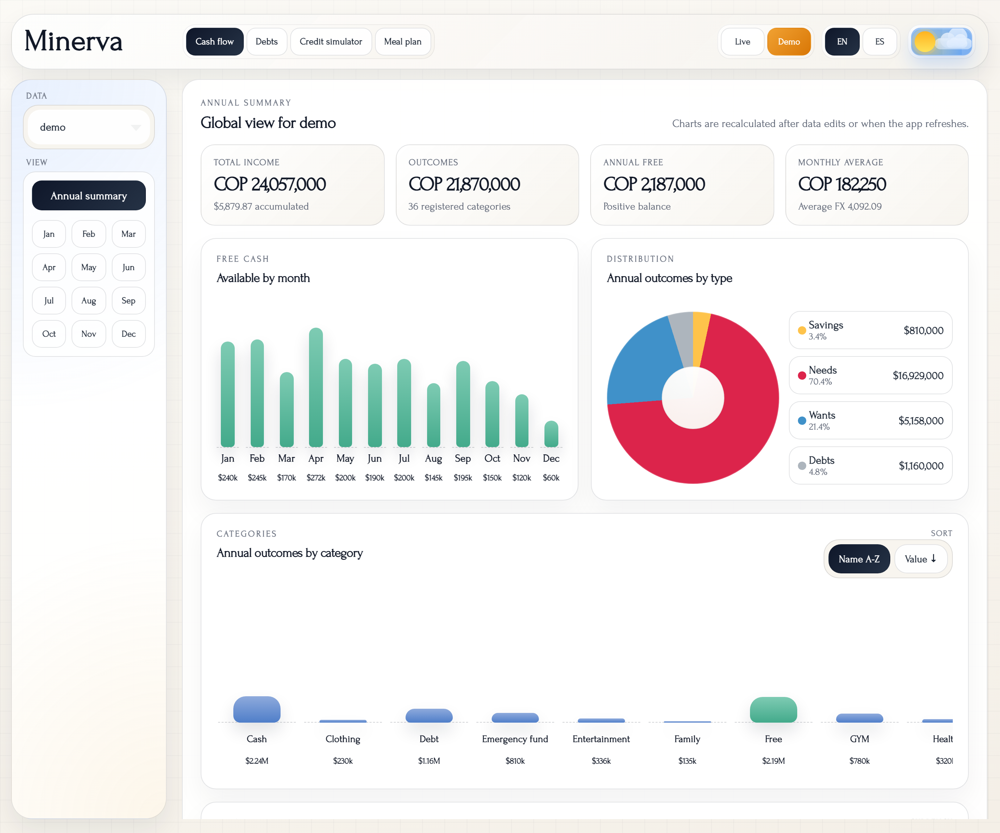
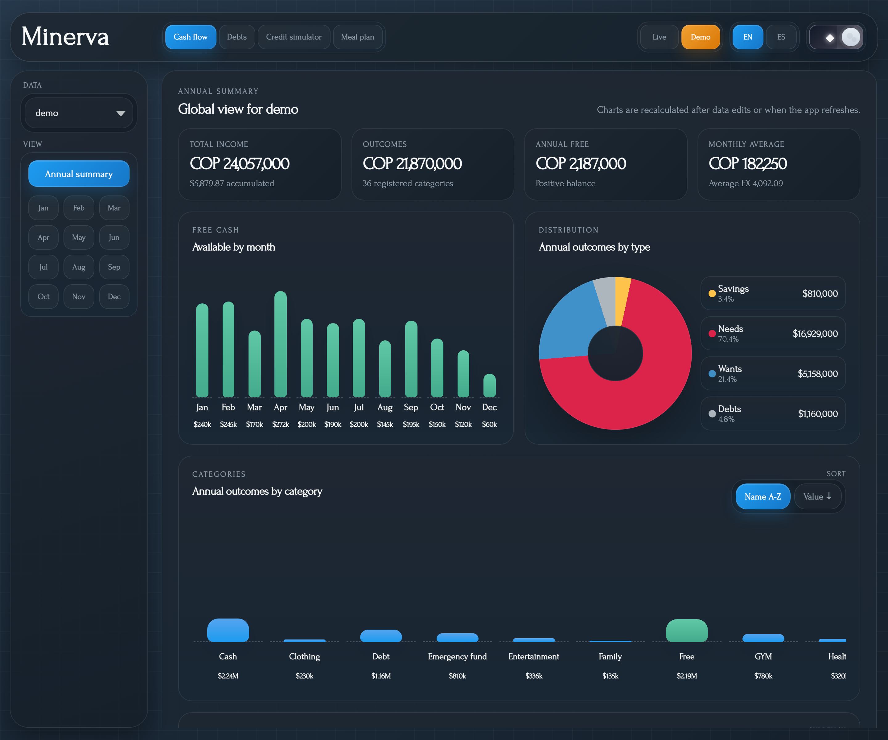
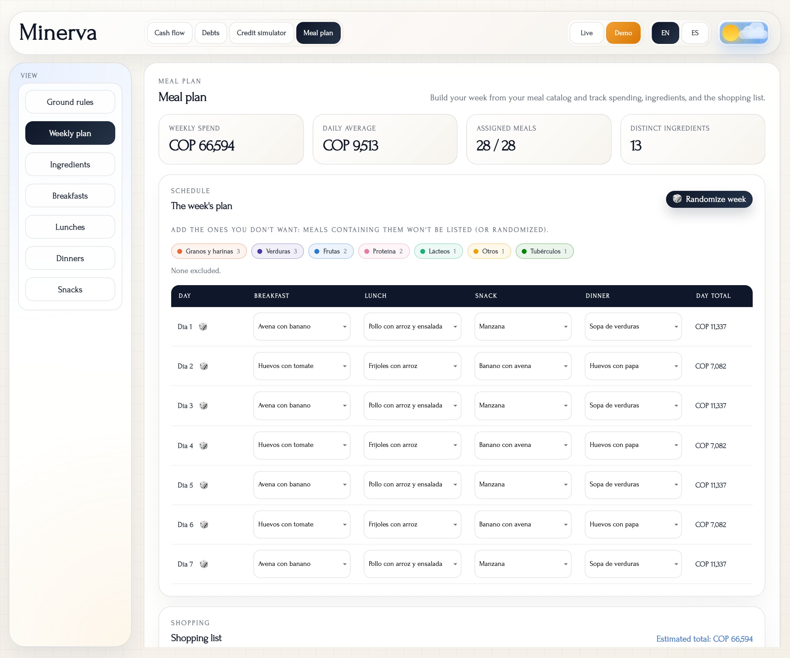
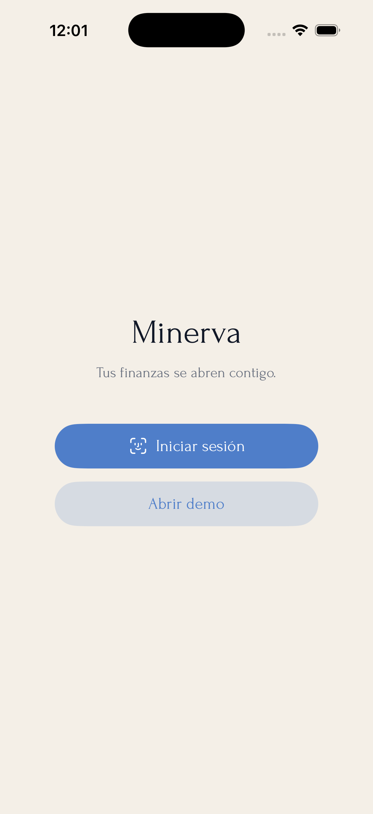
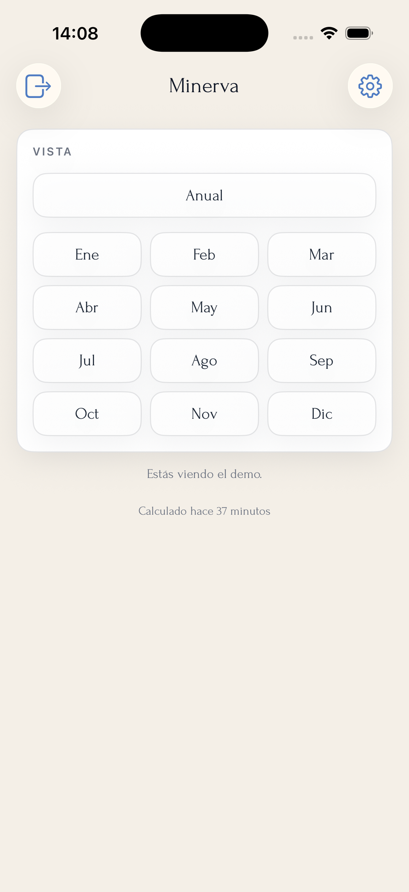

# Minerva

Minerva is a local-first personal finance suite — with a meal planner riding
along. A single Python server owns the data and **every money calculation**;
thin clients only paint what it answers. No database, no accounts, no
third-party services — the data is JSON files in your own iCloud Drive, and
none of it ever enters this repository.

## Screenshots

The React app, on the demo dataset:







The iOS app — the entry with its two doors, and the demo session:

<p>
  
  
</p>

## The one rule

All business logic lives in `server/server.py`. The clients never do money
math — they render what the API answers, so two dashboards can never disagree
on a number. The iOS app takes this further: it does not even talk HTTP — the
server precomputes its dashboard into files that iCloud carries to the phone.
(The one deliberate exception: the demo bundled inside the iOS app re-runs the
server's aggregation locally, validated against its exact numbers.)

## The pieces

Each one has its own README with setup and details:

| Piece | What it is | README |
|---|---|---|
| `server/` | The only brain: data, money math, HTTP API, and the phone's snapshot | [server/README.md](server/README.md) |
| `web/` | The React app (React 19 + Vite + TypeScript) — the primary UI | [web/README.md](web/README.md) |
| `ios/` | SwiftUI app: Face ID entry, reads the iCloud snapshot, edits through an outbox | [ios/README.md](ios/README.md) |
| `desktop/` | macOS launcher: server on/off behind Touch ID, opens the app in your browser | [desktop/README.md](desktop/README.md) |

## Structure

```text
.
+-- server               <- the only brain
|   +-- server.py        <- data, money math, endpoints
|   `-- bundled          <- ships with the repo: shared catalogs + the Demo dataset
+-- web                  <- the React app (Vite + TypeScript)
+-- ios                  <- the iOS app (SwiftUI, xcodegen)
+-- desktop              <- macOS launcher (Swift, build.sh)
+-- docs                 <- screenshots
`-- finance
    `-- data             <- your own data: a symlink into iCloud Drive,
                            ignored by git
```

## Quick start

```bash
python3 server/server.py      # serves everything on http://localhost:8123
```

Or without a terminal: `./desktop/build.sh` builds the macOS launcher into
`~/Applications/Minerva.app`. The iOS app needs Xcode and ten minutes —
`ios/README.md` walks through it. To hack on the web UI, `cd web && npm run
dev`.

## Data and privacy

Your data lives in `finance/data` — a symlink into iCloud Drive
(`iCloud Drive/Minerva/data`): backed up, versioned, synced to the phone, and
completely outside git. Every client has a **Live / Demo** switch; the demo
dataset ships with the repo and is an editable sandbox. Formats, endpoints and
the security model are documented in [server/README.md](server/README.md).
